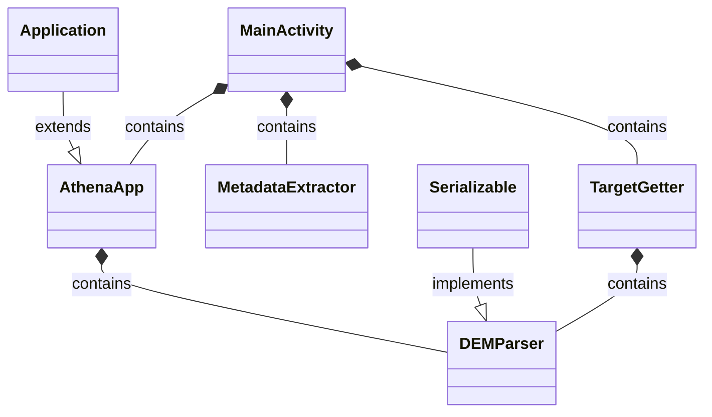
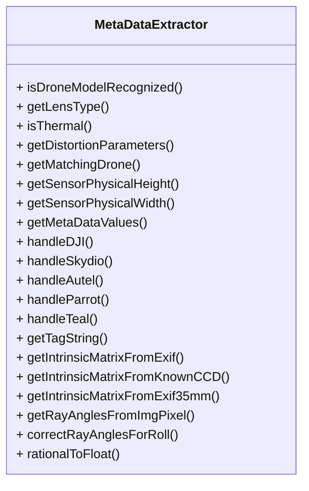
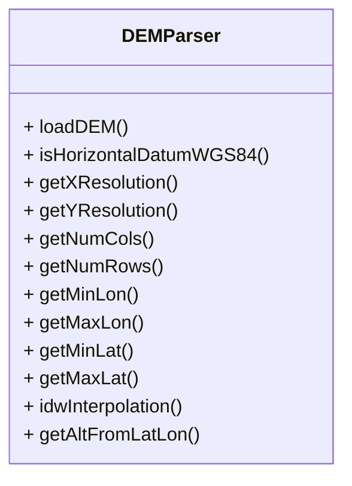
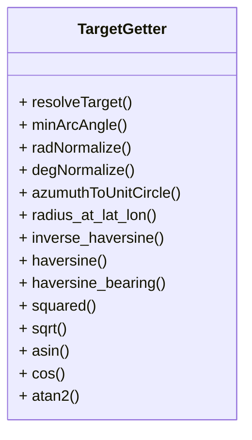

# OpenAthena Android Core Functionality
Core Casting Functionality within OA Android is defined by 3 main classes: MetaDataExtractor, DEMParser, and TargetGetter.
These classes are managed by the AthenaApp and MainActivity classes.

## OpenAthena Class Diagram

## OpenAthena Main Classes

### MetadataExtractor
The MetadataExtractor class is responsible for extracting metadata from a given drone image. Different drones have different metadata structures, so this class defines behaviors for extracting necessary common information from a variety of drone types. The main interaction with the engine is the getMetaDataValues() method, which handles the actual metadata extraction. 

### DEMParser
The DEMParser ingests a Digital Elevation Model(DEM) and loads it into the terrain raycast engine. The parser handles DEMs of different formats, ensures elevation type compatibility, and contains a local cache of the DEM being used. The method getAltFromLatLon() can then be called to extract the altitude of a given latitude longitude coordinate.

### TargetGetter
TargetGetter is the main terrain casting class within the software. All of the necessary mathematical functions are contained here, and this can be considered the heart of the terrain raycast software. Calling the resolveTarget() method with the necessary drone metadata will cast against the internal representation of a DEM.

### MainActivity and AthenaApp
These main components are managed by the MainActivity and AthenaApp classes. MainActivity can be considered the entry point for all major actions within OpenAthena. Metadata extraction, DEM management, and target acquisition all take place within MainActivity. Activities may not be persistent across the life of the application, so AthenaApp is used to hold all state information persistently across activities. It is for this reason that both TargetGetter and AthenaApp contain a DEMParser object, with the persistent object being passed to TargetGetter as necessary. These classes do not contribute to the actual casting functionality, but manage the casting functionality within Android.
