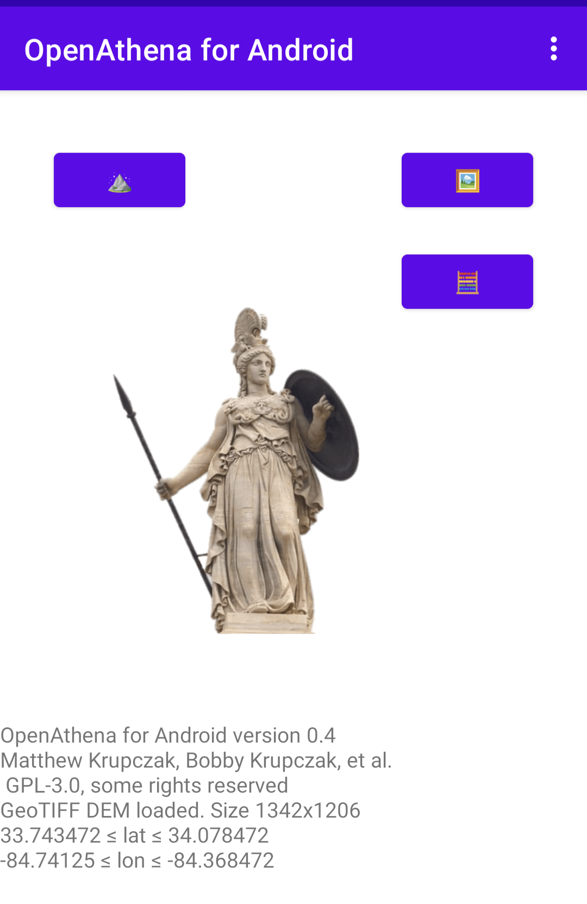
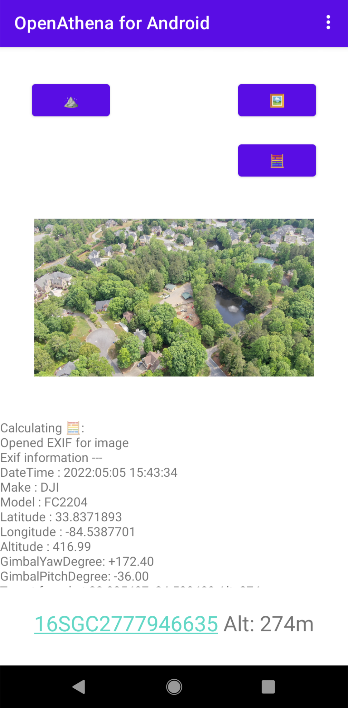

# OpenAthenaAndroid
OpenAthena for Android

# Operability
This project is not yet stable. The main [OpenAthena project](http://OpenAthena.com) running on a PC/Mac should be used instead, until otherwise noted

# Features
This project is not designed to maintain feature parity with the main [OpenAthena project](http://OpenAthena.com).
It is a parallel implementation of the same concept, on the Android platform to make it available
to more users

## GeoTIFF parsing:

This app uses the open source [tiff-java library](https://github.com/ngageoint/tiff-java) maintained by the U.S. [National Geospatial Intelligence Agency](https://www.nga.mil/) to read GeoTIFF Digital Elevation Model (DEM) files, stored as a ".tif" file.

For information on how to clip a GeoTIFF file of a customized area, see [this link](https://github.com/mkrupczak3/OpenAthena/blob/main/EIO_fetch_geotiff_example.md).

Load the DEM file, e.g. [cobb.tif](https://github.com/mkrupczak3/OpenAthena/raw/main/src/cobb.tif) using the " ⛰" button (NOTE: during file selection, the thumbnail preview for any GeoTIFF ".tif" file will be blank. This is normal.), and the app will display the size of the file as well as its Latitude and Longitude boundaries:

## JPG Drone sensor metadata parsing

This prototype version can only read sensor metadata from images taken by a DJI drone. The lat/lon/alt location information is acquired from the less-accurate EXIF tags of the image instead of its XMP metadata, so it should not be relied on for accuracy. The camera gimbal's azimuth and angle of depression is obtained from XMP metadata.

After loading a GeoTIFF DEM using the " ⛰" button, use the "🖼" button to select a drone image containing the necessary metadata. Then press the "🧮" button to calculate the target location on the ground:

## Live Telemetry from DJI-SDK

**TBD**

# Contributing

If you're interested in contributing to this project, feel free to make a fork. This project will
follow the [fork and pull model](https://reflectoring.io/github-fork-and-pull/) for third-party contributors