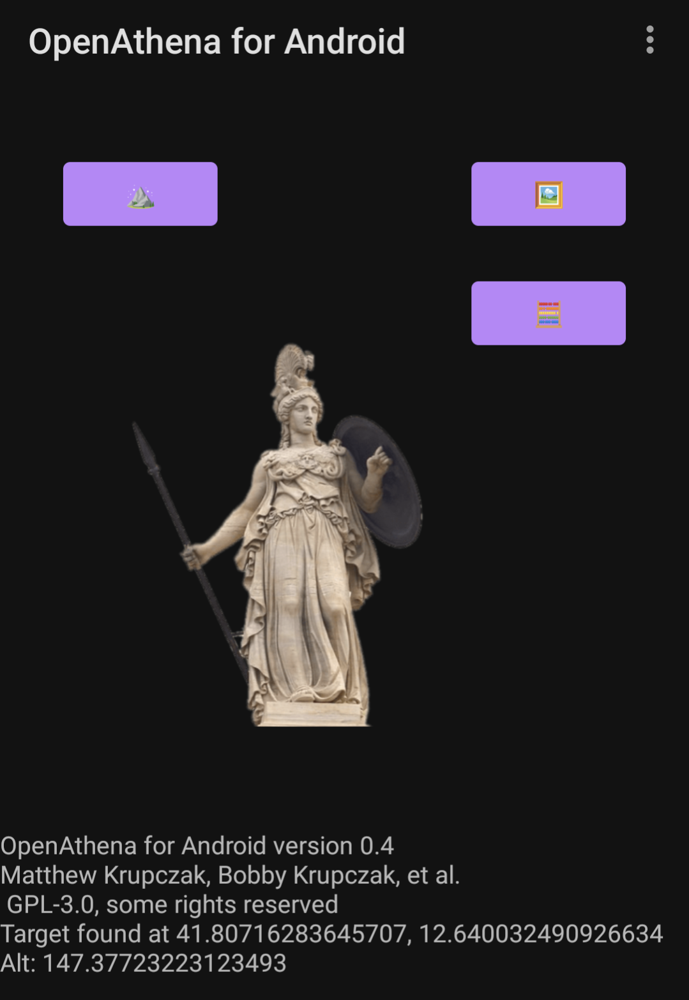

# OpenAthenaAndroid
OpenAthena for Android

# Operability
This project is not yet in an operable state. The main [OpenAthena project](http://OpenAthena.com) running on a PC/Mac is required until otherwise noted

# Features
This project is not designed to maintain feature parity with the main [OpenAthena project](http://OpenAthena.com).
It is a parallel implementation of the same concept, on the Android platform to make it available
to more users

## GeoTIFF parsing:

This app uses the open source [tiff-java library](https://github.com/ngageoint/tiff-java) maintained by the U.S. [National Geospatial Intelligence Agency](https://www.nga.mil/) to read GeoTIFF files

Load the file [Rome-30m-DEM.tif](https://github.com/mkrupczak3/OpenAthena/raw/main/src/Rome-30m-DEM.tif) using the " ⛰" button, and the app will calculate a target resolution for the simulated sensor data of a drone at latitude 41.801 N, 12.6483 E, 500m Altitude, 315° Azimuth, 20° Camera depression

## JPG Drone sensor metadata parsing

**TBD**

## Live Telemetry from DJI-SDK

**TBD**

# Contributing
If you're interested in contributing to this project, feel free to make a fork. This project will
follow the [fork and pull model](https://reflectoring.io/github-fork-and-pull/) for third-party contributors