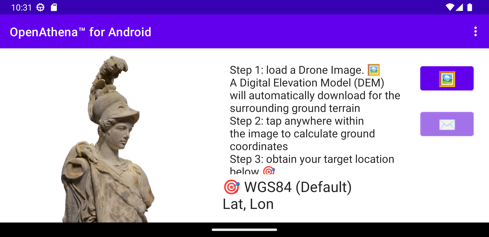
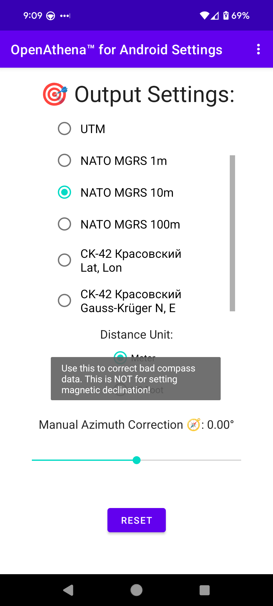
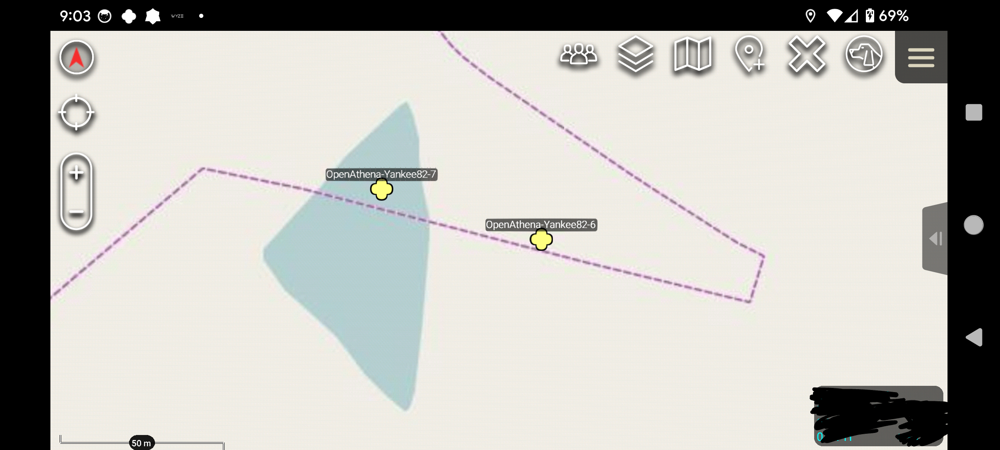

# OpenAthena™ for Android
OpenAthena for Android

An Android port of the [OpenAthena project](http://OpenAthena.com)

OpenAthena™ allows common drones to spot precise geodetic locations.

🖼️👨‍💻 + 🧮⛰️ = 🎯📍


<a href="https://github.com/mkrupczak3/OpenAthena"></a>

<a href="https://play.google.com/store/apps/details?id=com.openathena"></a>

<a href="https://play.google.com/store/apps/details?id=com.openathena"></a>


# License

Copyright (C) 2024 Theta Informatics LLC

This program is free software: you can redistribute it and/or modify it under the terms of the GNU General Public License as published by the Free Software Foundation, either version 3 of the License, or (at your option) any later version.

This program is distributed in the hope that it will be useful, but WITHOUT ANY WARRANTY; without even the implied warranty of MERCHANTABILITY or FITNESS FOR A PARTICULAR PURPOSE. See the GNU General Public License for more details.

You should have received a copy of the GNU General Public License along with this program. If not, see <https://www.gnu.org/licenses/>.

# Install

<a href="https://f-droid.org/packages/com.openathena">
    
</a>
<a href='https://apt.izzysoft.de/fdroid/index/apk/com.openathena'></a>
<a href='https://play.google.com/store/apps/details?id=com.openathena&pcampaignid=pcampaignidMKT-Other-global-all-co-prtnr-py-PartBadge-Mar2515-1'></a>

## GitHub releases page:
[https://github.com/Theta-Limited/OpenAthenaAndroid/releases](https://github.com/Theta-Limited/OpenAthenaAndroid/releases)


# Operation manual

## Troubleshooting

Certain error conditions may occur during regular use of this software. For troubleshooting information and a detailed description of the cause of possible errors, review the following document [TROUBLESHOOTING.md](./TROUBLESHOOTING.md):

[https://github.com/Theta-Limited/OpenAthenaAndroid/blob/master/TROUBLESHOOTING.md](https://github.com/Theta-Limited/OpenAthenaAndroid/blob/master/TROUBLESHOOTING.md)


## Obtain a GeoTIFF Digital Elevation Model:

To use this app, you need a GeoTIFF or DTED (resolution level 2 or higher) Digital Elevation Model (DEM) file. DEM files store terrain elevation data for an area on Earth. OpenAthena performs a ray-cast from a drone camera's position and orientation towards the terrain, which can be used to precisely locate any point within a given drone image.

GeoTIFF DEM files obtained from the [STRM GL1 30m](https://portal.opentopography.org/raster?opentopoID=OTSRTM.082015.4326.1) tend to produce more accurate target results than DTED

To obtain a GeoTIFF file for a certain area, use [this link](https://github.com/mkrupczak3/OpenAthena/blob/main/EIO_fetch_geotiff_example.md).

## Load a GeoTIFF Digital Elevation Model  ⛰:

Load the DEM file (e.g. cobb.tif) using the "⛰" button. The app will display the size of the file and its latitude and longitude boundaries:


(NOTE: during file selection, the thumbnail  image preview for any GeoTIFF ".tif" or DTED ".dt#" file will be blank. This is normal.)


## Setup for drone flight

### Compass sensor 🧭 calibration

It is _**strongly suggested**_ that you should [calibrate the drone's compass sensor for the local environment](https://phantompilots.com/threads/compass-calibration-a-complete-primer.32829/) before taking photos to be used with OpenAthena. Consult your drone's operation manual for this procedure. The image metadata from an un-calibrated drone can be several degrees off from the correct heading. This can result in dramatic target-resolution inaccuracies if the sensor is not calibrated. _**Always**_ verify a target match location from OpenAthena before use!

E.g.:


#### Optional: use the "Manual Azimuth Correction" slider to correct bad compass data

If you find your aircraft's compass sensor is still not providing correct heading information, you can use this slider to manually apply a configurable offset anywhere in the range of [-15.0°, +15.0°]. This offset will be added to your aircraft's camera heading before target calculation is performed:



**NOTE:** This value is _**NOT**_ for setting [magnetic declination](https://ngdc.noaa.gov/geomag/declination.shtml)! Magnetic declination is already accounted for by your drone's onboard digital World Magnetic Model (WMM). Improper use of this Manual Offset setting will result in bad target calculation output.

Your selected manual correction value is saved automatically between launches of the app. To reset the value, tap the "RESET" button in the Settings screen or move the slider to the middle.

### Let your drone acquire GPS lock before flying

For the best results for target calculation, it's important to let your drone sit at the launch position until it can get an accurate GPS fix. This is important for it to be able measure altitude correctly during flight.

On DJI drones, this indicator shows the number of GPS satellites visible to the drone:


Wait until at least 6 GPS satellites are visible (or you can confirm the GPS fix is good) before starting flight.

## Select an Image 🖼:

This app is compatible with images taken by select models of DJI, Skydio, Autel, and Parrot aircraft models. The drone's position and its camera's orientation are automatically extracted from the image metadata.

After loading a GeoTIFF DEM, use the "🖼" button to select a drone image containing the necessary metadata:


## Calculate a target 🎯:

Tap anywhere on the displayed image to calculate the corresponding target location on the ground. You can tap the result display box to copy the result text to your clipboard or open the position in Google Maps by clicking the blue hyperlink:


<!--  -->


## [ATAK](https://en.wikipedia.org/wiki/Android_Team_Awareness_Kit) Cursor on Target

When the "✉️" button is pressed, OpenAthena will send a Cursor on Target multicast UDP packet to udp://239.2.3.1:6969 to all devices on the same network as your device. Under default settings, this will cause a marker to show up in ATAK at the target location for all recipients:


Change the marker to its appropriate type (friend, suspect, hostile) in ATAK, then send the updated target to other networked users.

## Arbitrary Point Selection

OpenAthena allows users to tap any point in the image to locate it. Tapping on any point in the image will move the marker and calculate the new location. A new Cursor-on-Target message will not be sent to ATAK until the "✉️" button is pressed:




# Application Settings (optional) ⚙:

OpenAthena for Android supports multiple output modes for target calculation, including:

* Latitude, Longitude (standard WGS84)
* [Nato Military Grid Reference System](https://en.wikipedia.org/wiki/Military_Grid_Reference_System) (MGRS) 1m, 10m, and 100m
* [CK-42 Система координат](https://en.wikipedia.org/wiki/SK-42_reference_system) Latitude Longitude (an alternative geodetic system commonly used in slavic countries)
* [CK-42 Система координат](https://en.wikipedia.org/wiki/SK-42_reference_system) [Gauss-Krüger](https://desktop.arcgis.com/en/arcmap/latest/map/projections/gauss-kruger.htm) Grid: Northing, Easting (an alternative military grid reference system used by former Warsaw pact countries)

To change the ouptut mode of OpenAthena for Android, tap the kebab menu icon (three dots) at the top-right corner of the screen and select "Settings":


Select your desired output mode by pressing its button in the list:


Then press the back button or again tap the kebab menu icon (three dots) to return to the "Calculate" screen:


The app also supports selection between `Meter` and `US Foot` as the Distance Unit for the apps's output.

## Telemetry and localization from live video feed

The end goal of this project is to enable UAS operators to perform terrain-raycast localization from any point within a live video feed. The target resolution engine of this application is highly modular and may be extended to operate on any such telemetry data source. This capability will be specific to each UAS manufacturer's SDK; therefore, it will take time to develop.

# Contributing

## Code
If you're interested in contributing to this project, feel free to make a fork. This project will
follow the [fork and pull model](https://reflectoring.io/github-fork-and-pull/) for third-party contributors.


### Cloning this project with submodules
This project requires content from other git repositories (such as Theta's [DroneModels database](https://github.com/Theta-Limited/DroneModels)) to build correctly.

To clone this project properly, with the necessary submodules:
```bash
git clone --recursive git@github.com:Theta-Limited/OpenAthenaAndroid.git # can also use https clone url instead
```

If you have already cloned, and wish to acquire the neccesary submodule contents:
```bash
git submodule init
git submodule update
```

If you wish to update the contents of submodules from their source:
```bash
git submodule update --remote
```

### OPENTOPOGRAPHY_API_KEY in local.properties for DEM downloading

The OpenAthena app's automatic DEM downloading feature requires an Application Programming Interface (API) key from OpenTopography.org ([obtainable here](https://opentopography.org/blog/introducing-api-keys-access-opentopography-global-datasets)) to function. Such an API key authenticates the app with OpenTopography's servers for DEM downloading. A default key will be automatically included in releases from the Google Play or Apple AppStore; however, you will need to obtain one for yourself if you clone this project's code from GitHub or download it from F-Droid.

#### Add your OpenTopography API key from within the OpenAthena app
This capability is not yet present.

#### How to Acquire and use an OpenTopography API Key for building this project

Follow the instructions in the link below to obtain an API Key for OpenTopography.org:

[https://opentopography.org/blog/introducing-api-keys-access-opentopography-global-datasets](https://opentopography.org/blog/introducing-api-keys-access-opentopography-global-datasets)

After cloning this project, edit the file `local.properties` which is auto-generated by Android Studio in the root directory of the project. It should have appearance similar to below:
```bash
## This file must *NOT* be checked into Version Control Systems,
# as it contains information specific to your local configuration.
#
# Location of the SDK. This is only used by Gradle.
# For customization when using a Version Control System, please read the
# header note.
#Tue Jun 14 14:32:24 EDT 2022
sdk.dir=/home/YOURNAME/Android/Sdk/
```

Add a new line to the end of the `local.properties` file:
```bash
OPENTOPOGRAPHY_API_KEY=nlhhp3yd9ud54tr3eem4akqv49wcb23i
```


...replacing nlhh...23i with the OpenTopography API key you obtained from the above link


You will then be able to build the project and the API key will be included in the app.


# Acknowledgements

This software project would not be possible without the tireless work of many U.S. public servants and open source maintainers. Please see [CREDITS.md](./CREDITS.md) for a full list of included software libraries, and their authors and licenses.


Version v0.21.0 and later of this software use services of the website OpenTopography.org for DEM downloading within the app. The privacy policy of this website is available below:

https://opentopography.org/privacypolicy


OpenTopography is operated by the University of California San Diego with support from the National Science Foundation. It is not affiliated with the OpenAthena project.
