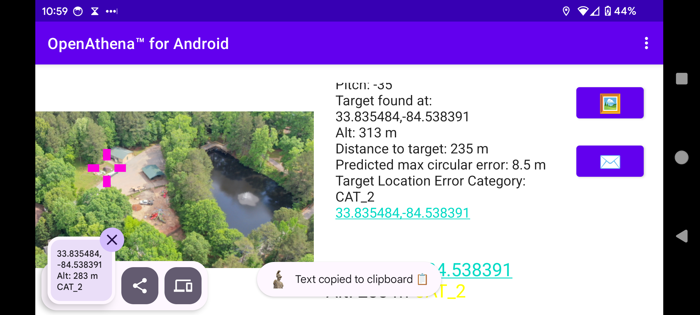
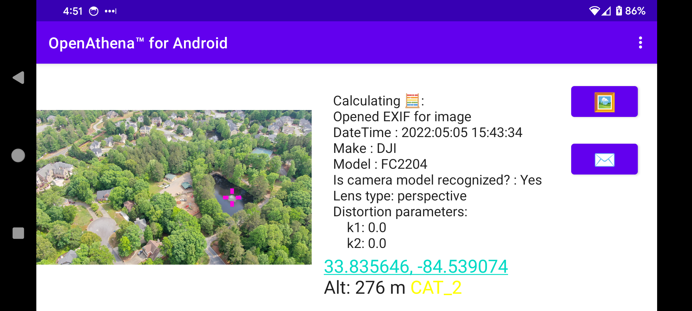

# OpenAthena™ for Android
OpenAthena for Android

An Android port of the [OpenAthena project](http://OpenAthena.com)

OpenAthena™ allows consumer and professional drones to spot precise geodetic locations.

🖼️👨‍💻 + 🧮⛰️ = 🎯📍

# Operation Guide

## Obtain a GeoTIFF Digital Elevation Model:

To use this app, you need a GeoTIFF Digital Elevation Model (DEM) file. GeoTIFF files store terrain elevation data for an area on Earth. OpenAthena performs a ray-cast from a drone camera's position and orientation towards the terrain, which can be used to precisely locate any point within a given picture.

To obtain a GeoTIFF file for a certain area, use [this link](https://github.com/mkrupczak3/OpenAthena/blob/main/EIO_fetch_geotiff_example.md).

## Load a GeoTIFF Digital Elevation Model  ⛰:

Load the DEM file (e.g. cobb.tif) using the "⛰" button. The app will display the size of the file and its latitude and longitude boundaries:

(NOTE: during file selection, the thumbnail  image preview for any GeoTIFF ".tif" file will be blank. This is normal.)

## Calibrate your drone's compass sensor 🧭 and take photos :

It is _**strongly suggested**_ that you should [calibrate the drone's compass sensor for the local environment](https://phantompilots.com/threads/compass-calibration-a-complete-primer.32829/) before taking photos to be used with OpenAthena. Consult your drone's operation manual for this procedure. The image metadata from an un-calibrated drone can be several degrees off from the correct heading. This can result in dramatic target-resolution inaccuracies if the sensor is not calibrated. _**Always**_ verify a target match location from OpenAthena before use!

E.x.:

## Select an Image 🖼:

This app is compatible with images taken by select models of DJI, Skydio, Autel, and Parrot aircraft models. The drone's position and its camera's orientation are automatically extracted from the image metadata.

After loading a GeoTIFF DEM, use the "🖼" button to select a drone image containing the necessary metadata:

## Calculate a target 🧮 🎯:

Press the "🧮" button to calculate the target location on the ground. You can tap the result display box to copy the result text to your clipboard or open the position in Google Maps by clicking the blue hyperlink:

## [ATAK](https://en.wikipedia.org/wiki/Android_Team_Awareness_Kit) Cursor on Target

When the "🧮" button is pressed, OpenAthena will automatically send a multicast packet to udp://239.2.3.1:6969 . Under default settings, this will cause a marker to show up in ATAK at the target location:

Change the marker to its appropriate type (friend, suspect, hostile) then send the target to other networked users.

## Arbitrary Point Selection

OpenAthena allows users to tap any point in the image to locate it. Tapping on any point in the image will move the marker and calculate the new location. A new Cursor-on-Target message will not be sent to ATAK until the "🧮" button is pressed:

# Application Settings (optional) ⚙:

OpenAthena for Android supports multiple output modes for target calculation, including:

* Latitude, Longitude (standard WGS84)
* [Nato Military Grid Reference System](https://en.wikipedia.org/wiki/Military_Grid_Reference_System) (MGRS) 1m, 10m, and 100m
* [CK-42 Система координат](https://en.wikipedia.org/wiki/SK-42_reference_system) Latitude Longitude (an alternative geodetic system commonly used in slavic countries)
* [CK-42 Система координат](https://en.wikipedia.org/wiki/SK-42_reference_system) [Gauss-Krüger](https://desktop.arcgis.com/en/arcmap/latest/map/projections/gauss-kruger.htm) Grid: Northing, Easting (an alternative military grid reference system used by former Warsaw pact countries)

To change the ouptut mode of OpenAthena for Android, tap the kebab menu icon (three dots) at the top-right corner of the screen and select "Settings":

Select your desired output mode by pressing its button in the list:

Then press the back button or again tap the kebab menu icon (three dots) to return to the "Calculate" screen. Finally, press the "🧮" button to re-calculate the target location according to your chosen output mode:

## LIVE Telemetry from DJI-SDK

**TBD**

# Contributing
## UI language translation
If you speak another language in addition to English, please consider contributing to the UI translation using the link below. The insights of a native-speaker are the only way to provide a good user experience for the program in a given language:

[https://www.transifex.com/krupczakorg/openathena-for-android/](https://www.transifex.com/krupczakorg/openathena-for-android/)

## Code
If you're interested in contributing to this project, feel free to make a fork. This project will
follow the [fork and pull model](https://reflectoring.io/github-fork-and-pull/) for third-party contributors
