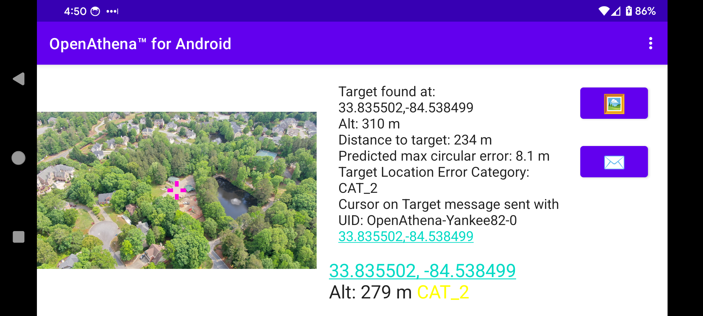
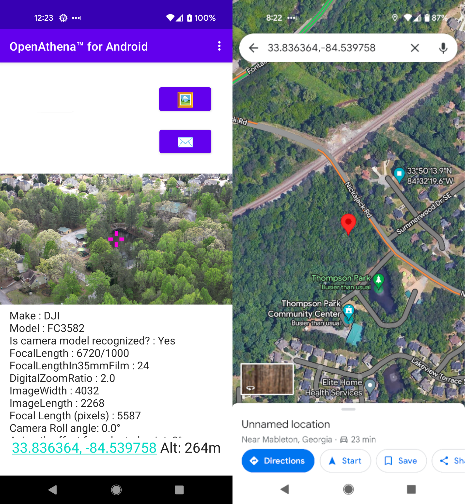

# OpenAthena™ for Android
OpenAthena for Android

An Android version of the [OpenAthena project](http://OpenAthena.com)

OpenAthena™ instantly calculates the ground location of any single pixel from any single drone image.

🖼️👨‍💻 + 🧮⛰️ = 🎯📍

**NOTICE: OpenAthena for Android is no longer open source to the general public, following a license change from Theta Informatics LLC. While no longer open source, it will remain available as a free app download on Google Play.**

 U.S. Government, Military, and other trusted end users can request source code access by emailing [support@theta.limited](mailto:support@theta.limited).

# License

Copyright (C) 2025 Theta Informatics LLC

# Install

## GitHub releases page:
[https://github.com/Theta-Limited/OpenAthenaAndroid/releases](https://github.com/Theta-Limited/OpenAthenaAndroid/releases)

# Operation manual

## Quickstart

### 1. Select an Image 🖼:

To being, tap the '🖼' button to select and load a drone image.

This app is compatible with images taken by most DJI, Skydio, Autel, Parrot, and Teal drone models. The drone's position and its camera's orientation are automatically extracted from image EXIF and XMP metadata. 

OpenAthena will automatically select and/or download a Digital Elevation Model (DEM) for the area around where your selected drone image was taken.

### 2. Calculate a target 🎯:

Tap anywhere within the displayed image to calculate the corresponding ground target location. You can tap the result display box to copy the result text to your clipboard, or open the position in the maps app of your choice by clicking on the blue hyperlink:

### 3. [ATAK](https://en.wikipedia.org/wiki/Android_Team_Awareness_Kit) Cursor on Target

When the "✉️" button is pressed, OpenAthena will send a Cursor on Target multicast UDP packet to udp://239.2.3.1:6969 to all devices on the same network. This will cause a marker to show up in ATAK at the target location for all recipients:

Change the marker to its appropriate type (friend, suspect, hostile) in ATAK, then send the updated target to other networked users.

### Arbitrary Point Selection

OpenAthena allows users to tap any point in the image to locate it. Tapping on any point in the image will move the marker and calculate the new location. A new Cursor-on-Target message will not be sent to ATAK until the "✉️" button is pressed:

## Tips for best results:

### Troubleshooting

Certain error conditions may occur during regular use of this software. For troubleshooting information and a detailed description of the cause of possible errors, review the following document [TROUBLESHOOTING.md](./TROUBLESHOOTING.md):

[https://github.com/Theta-Limited/OpenAthenaAndroid/blob/master/TROUBLESHOOTING.md](https://github.com/Theta-Limited/OpenAthenaAndroid/blob/master/TROUBLESHOOTING.md)

### Setup for drone flight

#### Compass sensor 🧭 calibration

It is _**strongly suggested**_ that you should [calibrate the drone's compass sensor for the local environment](https://phantompilots.com/threads/compass-calibration-a-complete-primer.32829/) before taking photos to be used with OpenAthena. Consult your drone's operation manual for this procedure. The image metadata from an un-calibrated drone can be several degrees off from the correct heading. This can result in dramatic target-resolution inaccuracies if the sensor is not calibrated. _**Always**_ verify a target match location from OpenAthena before use!

E.g.:

#### Optional: use the "Manual Azimuth Correction" slider to correct bad compass data

If you find your aircraft's compass sensor is still not providing correct heading information, you can use this slider to manually apply a configurable offset anywhere in the range of [-15.0°, +15.0°]. This offset will be added to your aircraft's camera heading before target calculation is performed:

**NOTE:** This value is _**NOT**_ for setting [magnetic declination](https://ngdc.noaa.gov/geomag/declination.shtml)! Magnetic declination is already accounted for by your drone's onboard digital World Magnetic Model (WMM). Improper use of this Manual Offset setting will result in bad target calculation output.

Your selected manual correction value is saved automatically between launches of the app. To reset the value, tap the "RESET" button in the Settings screen or move the slider to the middle.

### Let your drone acquire GPS lock before flying

For the best results for target calculation, it's important to let your drone sit at the launch position until it can get an accurate GPS fix. This is important for it to be able measure altitude correctly during flight.

On DJI drones, this indicator shows the number of GPS satellites visible to the drone:

Wait until at least 6 GPS satellites are visible (or you can confirm the GPS fix is good) before starting flight.
# Application Settings (optional) ⚙:

OpenAthena for Android supports multiple output modes for target calculation, including:

* Latitude, Longitude (standard WGS84)
* UTM ([Universal Transverse Mercator](https://en.wikipedia.org/wiki/Universal_Transverse_Mercator_coordinate_system))
* [Nato Military Grid Reference System](https://en.wikipedia.org/wiki/Military_Grid_Reference_System) (MGRS) 1m, 10m, and 100m
* [CK-42 Система координат](https://en.wikipedia.org/wiki/SK-42_reference_system) Latitude Longitude (an alternative geodetic system commonly used in slavic countries)
* [CK-42 Система координат](https://en.wikipedia.org/wiki/SK-42_reference_system) [Gauss-Krüger](https://desktop.arcgis.com/en/arcmap/latest/map/projections/gauss-kruger.htm) Grid: Northing, Easting (an alternative military grid reference system used by former Warsaw pact countries)

To change the ouptut mode of OpenAthena for Android, tap the kebab menu icon (three dots) at the top-right corner of the screen and select "Settings":

Select your desired output mode by pressing its button in the list:

Then press the back button or again tap the kebab menu icon (three dots) to return to the "Calculate" screen:

The app also supports selection between `Meter` and `US Foot` as the Distance Unit for the apps's output.

# Telemetry and localization from live video feed

The end goal of this project is to enable UAS operators to perform terrain-raycast localization from any point within a live video feed. The target resolution engine of this application is highly modular and may be extended to operate on any such telemetry data source. This capability will be specific to each UAS manufacturer's SDK; therefore, it will take time to develop.

# Contributing

Contributing to OpenAthena means being part of a community that values innovation and collaboration. It’s an opportunity to enhance your skills, connect with other talented individuals, and make a tangible impact on a tool that benefits drone enthusiasts and professionals around the world.

## How You Can Contribute

- **Bug Reports:** Encountering bugs? Report them on our GitHub issue tracker. Detailed reports can help us improve stability and user experience.
- **Feature Suggestions:** Have ideas on how to make OpenAthena even better? We love hearing new ideas! Share them as feature requests on our issue tracker.
- **Documentation:** Help us improve our documentation to ensure it's clear and accessible to everyone. All documentation will be in [Markdown format](https://duckduckgo.com/?t=ffab&q=markdown+cheat+sheet&ia=answer) 

### OPENTOPOGRAPHY_API_KEY in local.properties for DEM downloading

The OpenAthena app's automatic DEM downloading feature requires an Application Programming Interface (API) key from OpenTopography.org ([obtainable here](https://opentopography.org/blog/introducing-api-keys-access-opentopography-global-datasets)) to function. Such an API key authenticates the app with OpenTopography's servers for DEM downloading. A default key will be automatically included in releases from the Google Play or Apple AppStore; however, you will need to obtain one for yourself if you download an older version of this software GitHub or F-Droid.

#### Add your OpenTopography API key from within the OpenAthena app

If you have downloaded OpenAthena™ from GitHub or F-Droid, you will be prompted the following upon your first time opening the app:

Select the option "take me there now!" to go to the screen for obtaining and inputting your API key (it can also be accessed at any time from the 3 dot action menu on the top right).

You will see "API Key Status: X (Invalid)", with a description and link below:

Click on the link to be taken to the OpenTopography.org website. There, create an account, sign in, go to the "MyOpenTopo Dashboard", and click on "Get An API Key":

Finally, paste your API key into the OpenAthena™ for Android app and hit the "Apply button":

If you have an internet connection, the API Key Status should appear as ✅ (Valid). If you are offline the status will appear as ❓ (Unknown). If your API key is in fact valid, the software will work correctly with the OpenTopography API for DEM downloading once internet connection is restored.

# Acknowledgements

This software project would not be possible without the tireless work of many U.S. public servants and open source maintainers. Please see [CREDITS.md](./CREDITS.md) for a full list of included software libraries, and their authors and licenses.

Version v0.21.0 and later of this software use services of the website OpenTopography.org for DEM downloading within the app. The privacy policy of this website is available below:

https://opentopography.org/privacypolicy

OpenTopography is operated by the University of California San Diego with support from the National Science Foundation. It is not affiliated with the OpenAthena project.
