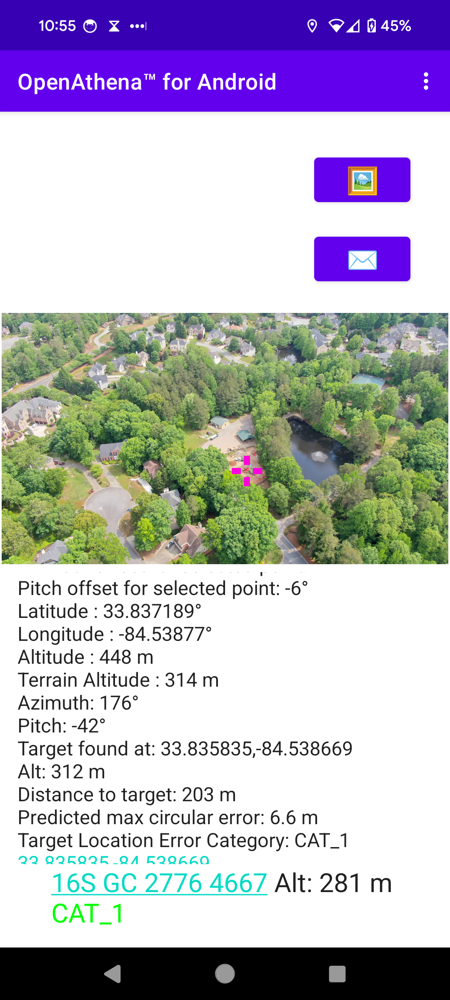

# Troubleshooting Manual


## OpenAthena™ for Android


Troubleshooting Manual for the Android version of the [OpenAthena project](http://OpenAthena.com)

OpenAthena™ allows common drones to spot precise geodetic locations.

🖼️👨‍💻 + 🧮⛰️ = 🎯📍


<a href="https://github.com/mkrupczak3/OpenAthena"></a>


<a href="https://play.google.com/store/apps/details?id=com.openathena"></a>


# License

Copyright (C) 2024 Theta Informatics LLC

This program is free software: you can redistribute it and/or modify it under the terms of the GNU General Public License as published by the Free Software Foundation, either version 3 of the License, or (at your option) any later version.

This program is distributed in the hope that it will be useful, but WITHOUT ANY WARRANTY; without even the implied warranty of MERCHANTABILITY or FITNESS FOR A PARTICULAR PURPOSE. See the GNU General Public License for more details.

You should have received a copy of the GNU General Public License along with this program. If not, see <https://www.gnu.org/licenses/>.


# Troubleshooting Manual

## Preface

OpenAthena for Android is designed to be usable by operators without the need for explicit technical training. A downside of this however is that fail conditions of the software can occur without the user having technical insight into why.

OpenAthena is designed to fail safe. If data is inaccurate, unusable, or incomplete enough for a calculation, the software will abort the calculataion rather than provide an inaccurate result.

This troubleshooting manual provides important context on common fail conditions and why they occur. This context is important for operators so they may overcome fail conditions which occur in certain specific conditions and adapt their use of the software to overcome them.

## Common failure conditions


(NOTE: during file selection, the thumbnail  image preview for any GeoTIFF ".tif" or DTED ".dt#" file will be blank. This is normal.)


### ERROR: failed to load DEM, not a GeoTIFF ".tif" or DTED2 ".dt2" file

OpenAthena requires a Digital Elevation Model (DEM) representing terrain altitude of an area of the earth to be loaded before calculations may be performed.

This error may occur when you use the "⛰" button to attempt to load a DEM.

Despite the content of this message, OpenAthena does actually supports DTED3 (.dt3) files as well.

The DEM loading process is automated in some versions of the software (v0.21.0 and higher) when internet connection is available. Otherwise, download and load an elevation model within the app (v0.21.0 and higher) while you have an internet connection. Alternatively, follow the instructions in the document "EIO_fetch_geotiff_example.md" for obtaining an elevation model using OpenTopography.org:

[https://github.com/Theta-Limited/OpenAthena/blob/main/EIO_fetch_geotiff_example.md](https://github.com/Theta-Limited/OpenAthena/blob/main/EIO_fetch_geotiff_example.md)

The software may only operate offline if a DEM covering the Area of Operations (AO) has been downloaded beforehand.

The **failed to load DEM** error can also occur in the following conditions:
* Your selected file was not a DEM, e.g. you selected a regular image file
* The selected DEM file was valid but not high enough in resolution (e.g. DTED level 0 or 1 files)
* Your DEM file is corrupted. Certain software, such as most Apple mail clients and the Signal messaging app, incorrectly treats GeoTIFF as regular TIFF images. When it attempts to automatically compress the file before transit it can corrupt its contents. Prevent corruption by zipping the file before sending it and unzipping the file on the recipient's device before loading it into the app.
* Your DEM file is in a format not compatible with this software. OpenAthena for Anrdroid does not support .zip archives, including those containing multiple elevation model tiles (as is commonly used with ATAK)


### How to obtain a Digital Elevation Model for your AO:

To use this app, you need a GeoTIFF or DTED (resolution level 2 or higher) Digital Elevation Model (DEM) file covering your Area of Operations. DEM files store terrain elevation data for an area on Earth. OpenAthena performs a simulated ray-cast from a drone camera's position and orientation towards the digital twin of Earth terrain represented by the elevation model. This technique is used by the software to precisely locate any pixel within a given drone image.

GeoTIFF DEM files obtained from the [STRM GL1 30m](https://portal.opentopography.org/raster?opentopoID=OTSRTM.082015.4326.1) tend to produce more accurate target results than DTED files.

To obtain a GeoTIFF file for a certain area, review the document "EIO_fetch_geotiff_example.md"
[https://github.com/mkrupczak3/OpenAthena/blob/main/EIO_fetch_geotiff_example.md](https://github.com/mkrupczak3/OpenAthena/blob/main/EIO_fetch_geotiff_example.md)

### ERROR: resolveTarget ran OOB at: 00.000000, 00.000000, Please ensure your DEM file covers the drone's location!

This error indicates that the attempted raycast for your target calcuation went Out Of Bounds (OOB) of the coverage of your loaded DEM. This most commonly means that your loaded DEM file does not cover the area the drone photo was taken in. This error can also occur however when the raycast misses terrain entirely, such as when a selected point is of the sky or the pitch angle value of the camera is inaccurate.

### ERROR: bad altitude or terrain data. This image is unusable. 🖼🚫🎯

This error indicates that the attempted raycast's start heigh was already below that of the terrain model. This only occurs in situations where either the drone altitude, the terrain model, or both are inaccurate.

The following are common causes of this error:
* Older DJI drone models incorrectly report their altitude as the difference from their launch point rather than relative to sea level. There is no mitigation, data from such drone models is unusable
* Altitude data from the drone is inaccurate. To mitigate occurance of this error, let the drone sit at its launch position longer to acquire a better GPS lock before takeoff.
* The elevation model height at the location the picture was taken is higher than actual terrain. This commonly occurs in areas with dense vegetation (especially in the southern hemisphere) or urban areas with tall buildings. In such scenarios, the first radar return from the sattelite for the SRTM mapping mission came from the tallest object rather than terrain. To mitigate this error, use an alternative Digital Terrain Model (DTM) rather than Digital Surface Model (DSM). [FABDEM](https://www.fathom.global/product/global-terrain-data-fabdem/) is one such existing commercial offering which attempts to remove the effect of forrests and buildings.

### ERROR: EXIF metadata not found!

The loaded image did not contain the metadata that is necessary for calculation. Many social media sites and messaging platforms automatically remove EXIF metadata from shared images in an attempt to protect user privacy. To mitigate this error, use an alternative messaging method such as email which does not remove EXIF data.

This error can also occur for drone models which do not store EXIF metadata in the first place. Such drone models are incompatible with OpenAthena.

### ERROR: XMP metadata not found!

Similar scenario as above.

### ERROR: Unable to open image file to calculate. Drone image 🖼 metadata is either missing or unusable. Is this a drone image?

This error indicates that usable metadata could not be found within the image. This most commonly occurs when the loaded image is from something like a screenshot rather than an actual drone image file.

### ERROR: make EXAMPLE not usable at this time

This error indicates that the camera/drone manufacturer which took the image is not yet supported.

OpenAthena does not work with images taken by smarpthones. The software's terrain-raycast technique requires an elevated view and accurate metdata indicating position and orientation of the camera. Smartphone images do not provide such preconditions and are thus incompatible with OpenAthena.

If you would like to make OpenAthena compatible with your drone model, please send example images to support@theta.limited via email along with the make and model name of your drone. For enhanced accuracy, inquire via the support email and Theta may ship you a calibration pattern poster to use your drone camera with our [camera calibration script](https://github.com/Theta-Limited/camera-calibration) at no cost to you.

If you are technically inclined, for faster integration consider [forking the repo and submitting a Pull Request on GitHub](https://reflectoring.io/github-fork-and-pull/). For new drone makes, you need to extend the function [getMetadataValues](https://github.com/Theta-Limited/OpenAthenaAndroid/blob/a6ca787b450f7cd2630ed0f2b208bde94f642a12/app/src/main/java/com/openathena/MetadataExtractor.java#L194) in [MetadataExtractor.java](https://github.com/Theta-Limited/OpenAthenaAndroid/blob/master/app/src/main/java/com/openathena/MetadataExtractor.java). Additionally, you will need to create an entry for your drone model in our [DroneModels database](https://github.com/Theta-Limited/DroneModels) to achieve accurate results.

### ⚠️DANGER: Autel drones have known accuracy problems ⚠️

Drones made by Autel Robotics typically have numerous firmware and hardware issues (this author's personal observation, not an disparagement). During development of OpenAthena, this author observed cases where metadata tags were misspelled, the reported vertical datum for altitude was incorrect, and other significant issues. Additionally, the drone hardware itself (excpeting sensor payloads) is generally of inferior quality to DJI and other contemporaries.

This error message will occur the first time an Autel drone image is loaded into a user's session of operating the app. It is intended to inform the user of possible accuracy problems which may occur, while still allowing them to proceed with calculation if they wish to do so.

### ERROR: <PARAMETER> metadata not found! This drone is incompatible with OpenAthena! 😭

This error can occur in rare cases where a certain necessary parameter, such as camera pitch angle, is not present in the image metadata.

### ERROR: Camera Pitch metadata found, but was invalid! This drone is incompatible with OpenAthena! 😭

This error occurs in rare cases with specific low end consumer-oriented DJI drone models (such as the Mini 2 and Mini 3, not inc. Pro versions). For these models, the manufacturer has intentionally removed camera pitch and yaw metadata, likely for the purpose of [market segmentation](https://en.wikipedia.org/wiki/Market_segmentation) to prevent these models from being used with professional image post-processing software.

### Compass sensor 🧭 calibration

It is _**strongly suggested**_ that you should [calibrate the drone's compass sensor for the local environment](https://phantompilots.com/threads/compass-calibration-a-complete-primer.32829/) before taking photos to be used with OpenAthena. Consult your drone's operation manual for this procedure. The image metadata from an un-calibrated drone can be several degrees off from the correct heading. This can result in dramatic target-resolution inaccuracies if the sensor is not calibrated. _**Always**_ verify a target match location from OpenAthena before use!

E.g.:


#### Optional: use the "Manual Azimuth Correction" slider to correct bad compass data

If you find your aircraft's compass sensor is still not providing correct heading information, you can use this slider to manually apply a configurable offset anywhere in the range of [-15.0°, +15.0°]. This offset will be added to your aircraft's camera heading before target calculation is performed:


**NOTE:** This value is _**NOT**_ for setting [magnetic declination](https://ngdc.noaa.gov/geomag/declination.shtml)! Magnetic declination is already accounted for by your drone's onboard digital World Magnetic Model (WMM). Improper use of this Manual Offset setting will result in bad target calculation output.

Your selected manual correction value is saved automatically between launches of the app. To reset the value, tap the "RESET" button in the Settings screen or move the slider to the middle.

### Let your drone acquire GPS lock before flying

For the best results for target calculation, it's important to let your drone sit at the launch position until it can get an accurate GPS fix. This is important for it to be able measure altitude correctly during flight.

On DJI drones, this indicator shows the number of GPS satellites visible to the drone:


Wait until at least 6 GPS satellites are visible (or you can confirm the GPS fix is good) before starting flight.

## Select an Image 🖼:

This app is compatible with images taken by select models of DJI, Skydio, Autel, and Parrot aircraft models. The drone's position and its camera's orientation are automatically extracted from the image metadata.

After loading a GeoTIFF DEM, use the "🖼" button to select a drone image containing the necessary metadata:


## Calculate a target 🎯:

Tap anywhere on the displayed image to calculate the corresponding target location on the ground. You can tap the result display box to copy the result text to your clipboard or open the position in Google Maps by clicking the blue hyperlink:


<!--  -->


## [ATAK](https://en.wikipedia.org/wiki/Android_Team_Awareness_Kit) Cursor on Target

When the "✉️" button is pressed, OpenAthena will send a Cursor on Target multicast UDP packet to udp://239.2.3.1:6969 to all devices on the same network as your device. Under default settings, this will cause a marker to show up in ATAK at the target location for all recipients:


Change the marker to its appropriate type (friend, suspect, hostile) in ATAK, then send the updated target to other networked users.

## Arbitrary Point Selection

OpenAthena allows users to tap any point in the image to locate it. Tapping on any point in the image will move the marker and calculate the new location. A new Cursor-on-Target message will not be sent to ATAK until the "✉️" button is pressed:


# Application Settings (optional) ⚙:

OpenAthena for Android supports multiple output modes for target calculation, including:

* Latitude, Longitude (standard WGS84)
* [Nato Military Grid Reference System](https://en.wikipedia.org/wiki/Military_Grid_Reference_System) (MGRS) 1m, 10m, and 100m
* [CK-42 Система координат](https://en.wikipedia.org/wiki/SK-42_reference_system) Latitude Longitude (an alternative geodetic system commonly used in slavic countries)
* [CK-42 Система координат](https://en.wikipedia.org/wiki/SK-42_reference_system) [Gauss-Krüger](https://desktop.arcgis.com/en/arcmap/latest/map/projections/gauss-kruger.htm) Grid: Northing, Easting (an alternative military grid reference system used by former Warsaw pact countries)

To change the ouptut mode of OpenAthena for Android, tap the kebab menu icon (three dots) at the top-right corner of the screen and select "Settings":


Select your desired output mode by pressing its button in the list:


Then press the back button or again tap the kebab menu icon (three dots) to return to the "Calculate" screen:



The app also supports selection between `Meter` and `US Foot` as the Distance Unit for the apps's output.

### OPENTOPOGRAPHY_API_KEY in local.properties for DEM downloading

The OpenAthena app's automatic DEM downloading feature requires an Application Programming Interface (API) key from OpenTopography.org ([obtainable here](https://opentopography.org/blog/introducing-api-keys-access-opentopography-global-datasets)) to function. Such an API key authenticates the app with OpenTopography's servers for DEM downloading. A default key will be automatically included in releases from the Google Play or Apple AppStore; however, you will need to obtain one for yourself if you clone this project's code from GitHub or download it from F-Droid.

If you have cloned and built this project but did not provide an OpenTopography API key, OpenAthena will be unable to download DEM data.

#### Add your OpenTopography API key from within the OpenAthena app
This capability is not yet present.

#### How to Acquire and use an OpenTopography API Key for building this project

Follow the instructions in the link below to obtain an API Key for OpenTopography.org:

[https://opentopography.org/blog/introducing-api-keys-access-opentopography-global-datasets](https://opentopography.org/blog/introducing-api-keys-access-opentopography-global-datasets)

After cloning this project, edit the file `local.properties` which is auto-generated by Android Studio in the root directory of the project. It should have appearance similar to below:
```bash
## This file must *NOT* be checked into Version Control Systems,
# as it contains information specific to your local configuration.
#
# Location of the SDK. This is only used by Gradle.
# For customization when using a Version Control System, please read the
# header note.
#Tue Jun 14 14:32:24 EDT 2022
sdk.dir=/home/YOURNAME/Android/Sdk/
```

Add a new line to the end of the `local.properties` file:
```bash
OPENTOPOGRAPHY_API_KEY=nlhhp3yd9ud54tr3eem4akqv49wcb23i
```


...replacing nlhh...23i with the OpenTopography API key you obtained from the above link


You will then be able to build the project and the API key will be included in the app.
